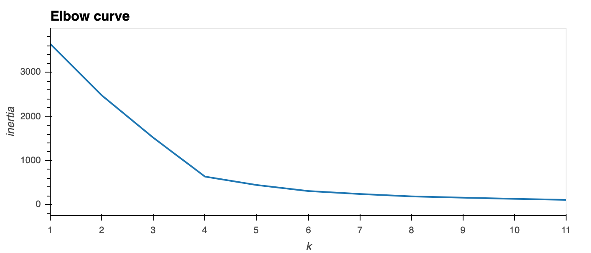

# Cyptocurrencies

## Overview:
  
   Using unsupervised machine learning analyze the crypto currencies traded in the market and group them based on key features
   which would help make companies to decide on which cryptocurrency is of interest for investment.
   
## Unsupervised Machine Learning:

   KMeans Unsupervised Machine Learnig model is used to cluster the data, inorder to be used we need to know the number of clusters upfront. Before proceeding further it might be good idea to reduce the nose in the data by reducing the dimension, rather than removing some of the dimension we could use Principal Component Ananlysis to reduce the dimension but at the same time minimize the information loss. Using PCA we have identified 3 component and the total variance ratio for them is approximately 6% which is not a lot. 
   
   Determine the number of clusters for the KMeans model we use Elbow Curve. Elbow curve is drawn using k (number of cluster) and inertia (sum of the squared error for each cluster) using the elbow like curve we could select the number of cluster for optimal performance of KMeans clustering. Please see the attachment for the elbow curve 
   
   Based on our elbow curve the curve seems to be flatenning after k=4, so we can choose our cluster size as 4 and get the KMeans clustering
   
   
